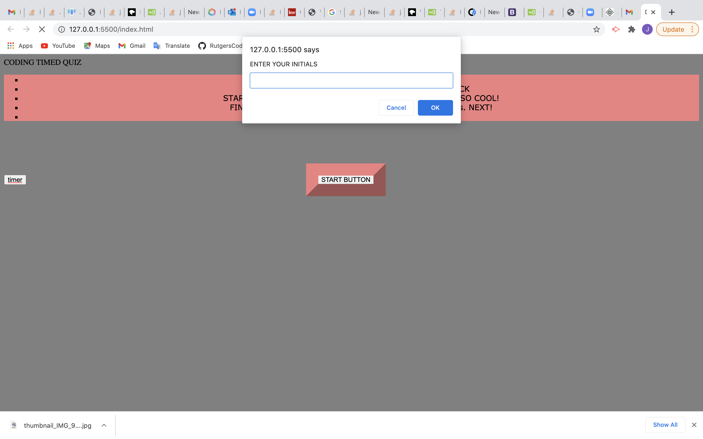
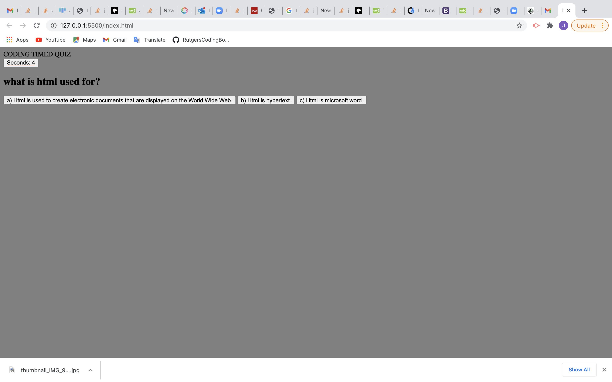
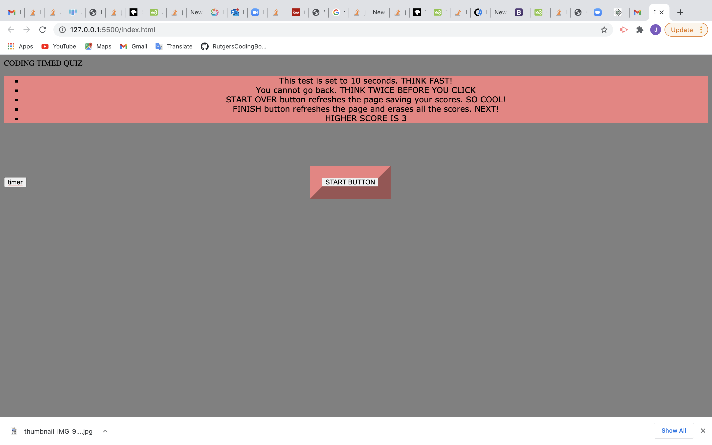
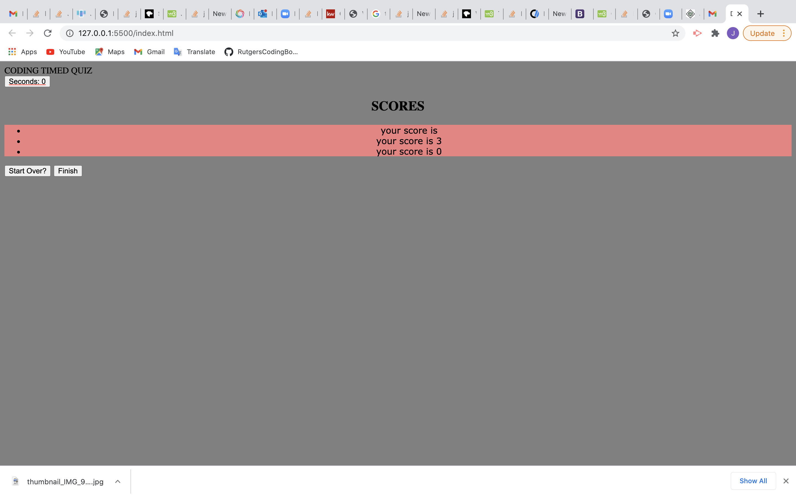

# timedCodeQuiz
# 04 Web APIs: Code Quiz

## Task
Create a multiple choice test with interactive coding challenges such as: a HTML and Css powered by JavaScript, a timer, and a score board.

## User Story

Using JavaScript apply local storage fundamentals to store high scores 

## Criteria
first a prompt window will save the initials of the user.
then the start button will move the user to the questions and will start the timer.
when user asnwers a question, is presented with another question immediately.
when the timer reaches zero
then game is over and the score is displayed
then start over button will save scores and allow user to continue playing
finish button will open the window for another user.

## View

The following images demonstrates the application functionality:

## links

You are required to submit BOTH of the following for review:

* The URL of the functional, deployed application.

* The URL of the GitHub repository. Give the repository a unique name and include a README describing the project.